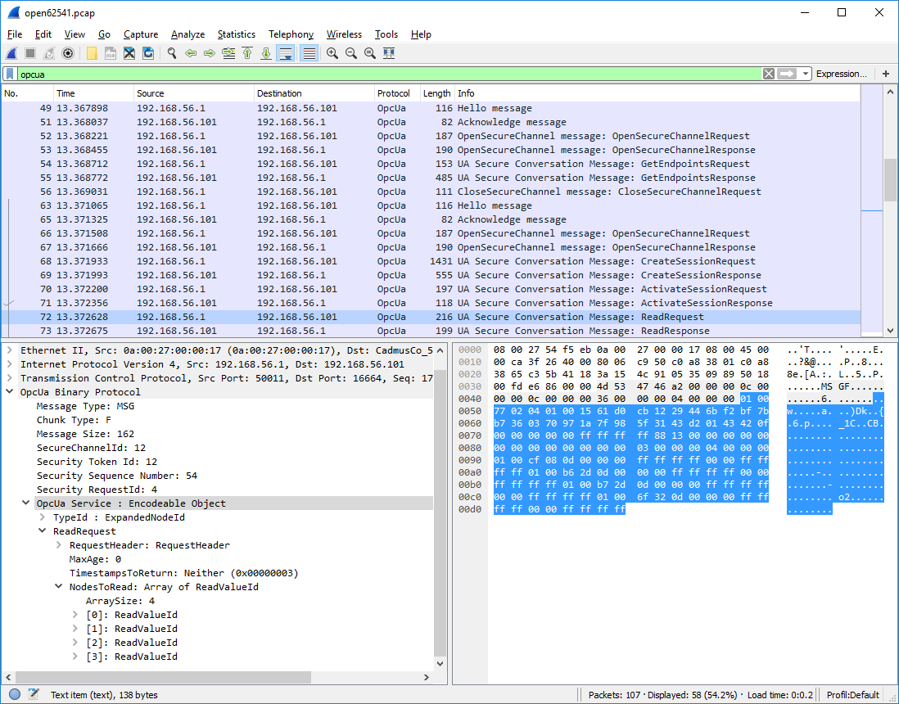

.. _protocol:

Protocol
========

In this section, we give an overview on the OPC UA binary protocol. We focus on
binary since that is what has been implemented in open62541. The TCP-based
binary protocol is by far the most common transport layer for OPC UA. The
general concepts also translate to HTTP and SOAP-based communication defined in
the standard. Communication in OPC UA is best understood by starting with the
following key principles:

Request / Response
  All communication is based on the Request/Response pattern. Only clients can
  send a request to a server. And servers can only send responses to a request.
  Usually, the server is hosted on the (physical) device, such as a sensor or a
  machine tool.

Asynchronous Responses
  A server does not have to immediately respond to requests and responses may be
  sent in a different order. This keeps the server responsive when it takes time
  until a specific request has been processed (e.g. a method call or when
  reading from a sensor with delay). Furthermore, Subscriptions (aka
  push-notifications) are implemented via special requests where the response is
  delayed until a notification is generated.

Establishing a Connection
-------------------------

A client-server connection in OPC UA consists of three nested levels: The raw
connection, a SecureChannel and the Session. For full details, see Part 6 of the
OPC UA standard.

Raw Connection
  The raw connection is created by opening a TCP connection to the corresponding
  hostname and port and an initial HEL/ACK handshake. The handshake establishes
  the basic settings of the connection, such as the maximum message length.

SecureChannel
  SecureChannels are created on top of the raw TCP connection. A SecureChannel
  is established with an *OpenSecureChannel* request and response message pair.
  **Attention!** Even though a SecureChannel is mandatory, encryption might
  still be disabled. The *SecurityMode* of a SecureChannel can be either
  ``None``, ``Sign``, or ``SignAndEncrypt``. As of version 0.2 of open62541,
  message signing and encryption is still under ongoing development.

  With message signing or encryption enabled, the *OpenSecureChannel* messages
  are encrypted using an asymmetric encryption algorithm (public-key
  cryptography) [#key-mgmnt]_. As part of the *OpenSecureChannel* messages,
  client and server establish a common secret over an initially unsecure
  channel. For subsequent messages, the common secret is used for symmetric
  encryption, which has the advantage of being much faster.

  Different *SecurityPolicies* -- defined in part 7 of the OPC UA standard --
  specify the algorithms for asymmetric and symmetric encryption, encryption key
  lengths, hash functions for message signing, and so on. Example
  SecurityPolicies are ``None`` for transmission of cleartext and
  ``Basic256Sha256`` which mandates a variant of RSA with SHA256 certificate
  hashing for asymmetric encryption and AES256 for symmetric encryption.

  The possible SecurityPolicies of a server are described with a list of
  *Endpoints*. An endpoint jointly defines the SecurityMode, SecurityPolicy and
  means for authenticating a session (discussed in the next section) in order to
  connect to a certain server. The *GetEndpoints* service returns a list of
  available endpoints. This service can usually be invoked without a session and
  from an unencrypted SecureChannel. This allows clients to first discover
  available endpoints and then use an appropriate SecurityPolicy that might be
  required to open a session.

Session
  Sessions are created on top of a SecureChannel. This ensures that users may
  authenticate without sending their credentials, such as username and password,
  in cleartext. Currently defined authentication mechanisms are anonymous login,
  username/password, Kerberos and x509 certificates. The latter requires that
  the request message is accompanied by a signature to prove that the sender is
  in possession of the private key with which the certificate was created.

  There are two message exchanges required to establish a session:
  *CreateSession* and *ActicateSession*. The ActivateSession service can be used
  to switch an existing session to a different SecureChannel. This is important,
  for example when the connection broke down and the existing session is
  reused with a new SecureChannel.

.. [#key-mgmnt] This entails that the client and server exchange so-called
   public keys. The public keys might come with a certificate from a key-signing
   authority or be verified against an external key repository. But we will not
   discuss certificate management in detail in this section.

Structure of a protocol message
-------------------------------

For the following introduction to the structure of OPC UA protocol messages,
consider the example OPC UA binary conversation, recorded and displayed with the
`Wireshark <https://www.wireshark.org/>`_ tool, shown in :numref:`ua-wireshark`.

.. _ua-wireshark:

   OPC UA conversation displayed in Wireshark

The top part of the Wireshark window shows the messages from the conversation in
order. The green line contains the applied filter. Here, we want to see the OPC
UA protocol messages only. The first messages (from TCP packets 49 to 56) show
the client opening an unencrypted SecureChannel and retrieving the server's
endpoints. Then, starting with packet 63, a new connection and SecureChannel are
created in conformance with one of the endpoints. On top of this SecureChannel,
the client can then create and activate a session. The following *ReadRequest*
message is selected and covered in more detail in the bottom windows.

The bottom left window shows the structure of the selected *ReadRequest*
message. The purpose of the message is invoking the *Read* :ref:`service
<services>`. The message is structured into a header and a message body. Note
that we do not consider encryption or signing of messages here.

Message Header
  As stated before, OPC UA defines an asynchronous protocol. So responses may be
  out of order. The message header contains some basic information, such as the
  length of the message, as well as necessary information to relate messages to
  a SecureChannel and each request to the corresponding response. "Chunking"
  refers to the splitting and reassembling of messages that are longer than the
  maximum network packet size.

Message Body
  Every OPC UA :ref:`service <services>` has a signature in the form of a
  request and response data structure. These are defined according to the OPC UA
  protocol :ref:`type system <types>`. See especially the :ref:`auto-generated
  type definitions<generated-types>` for the data types corresponding to service
  requests and responses. The message body begins with the identifier of the
  following data type. Then, the main payload of the message follows.

The bottom right window shows the binary payload of the selected *ReadRequest*
message. The message header is highlighted in light-grey. The message body in
blue highlighting shows the encoded *ReadRequest* data structure.
